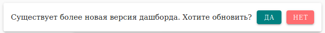

ОТ.ПЛАТФОРМА

Начало работы

Дата редакции: 24 ноября 2021 г.

**Руководство пользователя**

Оглавление

[Введение в ОТ.Платформу](#введение-в-отплатформу)

[Начало работы](#начало-работы)

[Исследование данных](#исследование-данных)

[Создание запроса к данным](#создание-запроса-к-данным)

[Базовые команды языка OTL для
запросов](#базовые-команды-языка-otl-для-запросов)

[Конструирование дашбордов](#конструирование-дашбордов)

[Панель инструментов дашборда](#панель-инструментов-дашборда)

[Создание дашборда](#создание-дашборда)

[Создание источников данных](#создание-источников-данных)

[Размещение компонентов визуализации данных на
дашборде](#размещение-компонентов-визуализации-данных-на-дашборде)

[Наполнение компонента визуализации
данными](#наполнение-компонента-визуализации-данными)

[Сохранение дашборда на сервере](#сохранение-дашборда-на-сервере)

[Доработка источников данных](#доработка-источников-данных)

[Использование токенов в запросах](#использование-токенов-в-запросах)

[Использование Выпадающего списка](#использование-выпадающего-списка)

[Использование Текстового блока](#использование-текстового-блока)

[Использование Выбора времени](#использование-выбора-времени)

[Использование токенов в названиях визуальных
компонентов](#использование-токенов-в-названиях-визуальных-компонентов)

[Использование событий](#использование-событий)

[Событие изменения свойства компонента (onclick …
set)](#событие-изменения-свойства-компонента-onclick--set)

[Событие заполнения отчета
(onclick...changeReport)](#событие-заполнения-отчета-onclickchangereport)

[Событие перехода на другой дашборд (onclick …
go)](#событие-перехода-на-другой-дашборд-onclick--go)

[Событие сравнения значений токена
(OnTokenCompare...set)](#событие-сравнения-значений-токена-ontokencompareset)

[Событие сравнения данных Таблицы
(OnDataCompare...set)](#событие-сравнения-данных-таблицы-ondatacompareset)

[Использование дашбордов](#использование-дашбордов)

[Использование шаблонов отчётов на
дашборде](#использование-шаблонов-отчётов-на-дашборде)

[Экспорт и импорт дашбордов](#экспорт-и-импорт-дашбордов)

# Введение в ОТ.Платформу

**ОТ.Платформа (Open Technologies Platform) –** универсальная система сбора,
аналитики и визуализации больших объемов машинных данных (machine-generated
data), построенная на базе стека программных продуктов с открытым исходным кодом
и компонентов собственной разработки. Разработчик ОТ.Платформы – российская
компания ISG Neuro, входящая в группу компаний Открытые Технологии.

Ключевой особенностью ОТ.Платформы является минимальный барьер входа для
пользователей системы, что обеспечивает возможность использования самых
современных технологий машинного обучения, аналитики больших данных и
распределенной обработки информации с минимальными затратами на изучение этих
технологий.

**EVA** – это web-интерфейс ОТ-Платформы, предназначенный для визуализации
результатов обработки большого объема данных (Big Data) и настройки логики
взаимодействия между отдельными компонентами визуализации данных.

Работа ведётся на интерактивной информационно-аналитической панели – *дашборде*.

**Дашборд** – совокупность интерактивных компонентов визуализации данных и
логики взаимодействия между ними.

Данные на дашборд загружаются на основе подготовленных пользователем запросов –
*источников данных*.

**Источник данных**  – сформированный пользователем запрос к данным, визуальное
представление которых он хочет получить на дашборде. Запрос создаётся
пользователем на высокоуровневом языке OTL (см.Руководство пользователя “Команды
языка OTL”).

Данные, выбранные с помощью источников данных, отображаются в *визуализациях*.

**Визуализации** – интерактивные компоненты визуализации данных различных типов,
размещённые на дашборде.

**EVA** поддерживает компоненты двух типов:

-   Компоненты отображения данных:

    -   **Таблица**

    -   **Мультилинейный график**

    -   **Карта**

    -   **Круговая диаграмма**

    -   **Граф**

    -   **Кустовая схема**

    -   **Диаграмма Гантта**

    -   **Плитка**

    -   **Изображение**

    -   **Число**

    -   **Граф_old**

    -   **Тепловая карта**

    -   **Single Value**

-   Компоненты, реализующие логику взаимодействия между пользователем и
    компонентами отображения данных:

-   **Выпадающий список**

-   **Выбор времени**

-   **Кнопка**

-   **Текстовый блок**

**Токен** – внутренняя переменная для дашборда, значение которой присваивается в
зависимости от действий пользователя.

Токены используются:

-   в источниках данных – для фильтрации данных, передаваемых на дашборд, и
    получения таким образом в интерактивных компонентах новых данных;

-   в событиях – как для модификации отображения данных в интерактивных
    компонентах, так и для модификации свойств самих интерактивных компонентов.

**Событие** – логика взаимодействия между компонентами визуализации данных,
реализуемая в ответ на действие пользователя.

**Место EVA в общей схеме компонентов ОТ-Платформы**

OT.Платформа является универсальной системой сбора, аналитики и визуализации
больших объемов машинных данных (machine-generated data).

В её состав входит ряд компонентов, специализирующихся на выполнении
определённых функций:

-   *Извлечение-Преобразование-Загрузка.*

    *Apache Nifi.*

    В систему поступают разноформатные данные. С помощью Apache Nifi они
    обрабатываются, приобретают единую структуру и получают необходимые атрибуты
    для дальнейшего использования.

-   *Хранилище данных.*

    *GlusterFS*

    Первоначально обработанные данные поступают в хранилище GlusterFS.
    Информация размещена в распределенном и реплицированном виде для обеспечения
    надежного хранения и отказоустойчивости системы:

-   индексированные данные – **индексы**;

-   оперативные данные для быстрого доступа – **кэш**; оперативные данные за
    время, заданное в *EVA*, и результаты поисковых запросов.

-   *Обработка данных.*

    *Apache Spark*

    Приложение *Apache Spark* выполняет параллельную обработку данных на
    основании полученных из *Базы данных* поисковых запросов и выгружает
    запрошенные данные в кэш Хранилища данных.

-   *База данных.*

    *PostgreSQL*

    База данных обеспечивает обмен служебными сообщениями между приложениями
    *Apache Spark* и *OT-Rest*, проводит аудит поисковых запросов и хранит всю
    информацию об инструментах визуализации приложения *EVA*.

-   *Взаимодействие пользовательского интерфейса и серверной части*

    *ОТ.REST*

    *ОТ.REST* осуществляет предварительную обработку поисковых запросов и
    передаёт их на дальнейшую обработку в приложение *Apache Spark*. Данные,
    подготовленные по запросам, перемещает из Хранилища в *EVA* для
    визуализации.

-   *Визуализация данных.*

    *EVA*

    Интерактивная среда разработки *EVA* позволяет разрабатывать и выполнять
    запросы к различным источникам данных, обрабатывать и визуализировать
    данные.

    EVA создаёт *Локальное хранилище* на компьютере пользователя для
    оперативного хранения используемых им инструментов EVA (дашбордов и проч.).

**Функциональные модули EVA**

Основными модулями EVA, с которыми начинает работать пользователь, являются:

-   [**Конструирование дашбордов**](#конструирование-дашбордов) – инструмент
    предназначен для разработки и использования сложных интерактивных дашбордов,
    позволяющих визуализировать данные в различных форматах представления.

-   [**Исследование данных**](#исследование-данных) – инструмент для отладки
    запросов к данным. С его помощью Вы можете создавать запросы, отлаживать их
    и визуализировать результаты выполнения в различных интерактивных
    компонентах.

Кроме того, в EVA представлен модуль **Конструирование отчетов** – инструмент
для загрузки шаблонов отчётов в систему с последующим их автоматизированным
заполнением на базе подготовленных запросов.

С подробным описанием всех модулей EVA, технологии работы ними, а также экранных
форм модуля “Конструирование дашбордов” с детальным описанием полей и набора
поддерживаемой функциональности Вы можете ознакомиться в Руководстве
пользователя “EVA”.

# Начало работы

Перед тем, как приступить к работе с ОТ.Платформой, убедитесь, что:

-   Данные для Вашей работы загружены в Хранилище.

-   Вам предоставлен доступ к ОТ.Платформе.

Для входа в систему нужно в браузере перейти по предоставленной Вам ссылке на
веб-интерфейс Платформы (EVA), ввести логин и пароль:

После авторизации Вы можете начать работу с ОТ.Платформой.

После входа в EVA на Главной странице Вы увидите Главную панель
:

Справа по клику на  откроется
окно “Профиль”:

Рассмотрим инструменты подробнее:

-   **** – режим управления
    доступом пользователей:

    -   пользователь с привилегией **admin_all** имеет права на выполнение этого
        действия для всех пользователей EVA;

    -   пользователь с другим уровнем доступа может просматривать информацию о
        предоставленных ему правах и редактировать свой пароль.

-    – режим выбора имеющейся
    темы оформления EVA, а также создания новой темы, её редактирования и
    удаления.

     – после нажатия на эту
    иконку на экране появится окно, предназначенное для настройки своей темы.
    Под полем **Название темы** находится краткое Руководство, в котором
    приведён перечень настраиваемых элементов приложения и какие поля окна
    управляют их цветовым оформлением.

    Созданную Вами тему в дальнейшем можно редактировать и удалить.

    

-   **** – выход из программы и
    предоставление возможности вернуться, например, под другим идентификатором
    пользователя.

Кроме того, обратите внимание на информационную составляющую – система выводит
на заголовок вкладки браузера названия модулей и дашбордов, с которыми Вы
работаете, а также сохраняет ссылки на них в истории браузера.

А теперь начнём знакомство с EVA с модуля “Исследование данных”.

# 

# Исследование данных

Рассмотрим функциональные возможности модуля “Исследование данных” подробнее.

Область “Введите запрос” предназначена для ввода запроса.

Для формирования запроса используется высокоуровневый язык OTL.

Все команды – подробное описание, синтаксис и примеры использования в запросах –
представлены в Руководстве “Команды языка OTL”.

Здесь же мы остановимся на базовом наборе команд и разберём пошагово процедуру
создания запросов с их использованием.

Подготовленный запрос запускается на выполнение по кнопке
.

Если в процессе работы Вам требуется открыть ещё одну вкладку для работы по
исследованию данных, то нажмите кнопку
.

Область ниже – область визуализации данных.

Весь набор, представленных для работы интерактивных компонентов представлен в
виде кнопок, по нажатию на которые результаты выполнения запроса будут
интерпретированы в выбранный Вами формат визуализации данных.

Область “Статистика” представляет:

-   поля данных, участвующих в запросе – перечень идентификаторов с указанием их
    типов выводятся автоматически после выполнения запроса;

-   значения поля данных, количество и процент их повторений – эта информация
    выводится по полю, выбранному с помощью “мыши”.

Настройки для запроса заданы по умолчанию.

Просмотреть и изменить их можно по копке
. Для настройки доступны
следующие параметры:

-   Начало и окончание отрезка времени, за который будет выполнена выгрузка
    данных (по умолчанию: 0 (т.е. за весь период). Задать ограничения можно
    вручную в формате Epoch time или выбрать в окне выбора даты и времени,
    вызванном по кнопке ****.

-   Дополнительные параметры обычно свернуты – их меняют крайне редко:

-   *Time-out* – время ожидания результата запроса, в секундах (по умолчанию:
    100 сек);

-   *Cache_ttl* – время хранения результата на сервере, в секундах (по
    умолчанию: 100 сек).

## Создание запроса к данным

Запрос состоит из серии команд.

Команды пишутся последовательно и отделяются друг от друга конвейером (\|).

**Примечание.**

*По горячей клавише* **Ctrl+\\** *текст, начинающийся с “\|”, будет перенесён на
новую строку.*

Данные, полученные при выполнении команды, являются исходными данными для
следующей команды.

Для начала достаточно загрузить весь набор данных, с которыми Вы будете
работать. Для этого в запросе используйте команду загрузки данных с указанием в
запросе указать индекс-папки, с нужными данными.

\| otstats ...

Данные будут загружены в EVA и отобразятся в нижней области в виде таблицы, т.к.
этот компонент визуализации настроен для отображения по умолчанию.

**Важно!**

*Максимально возможный объём выводимых данных ограничен. По умолчанию он
составляет – 1000 записей.*

*Однако, эта настройка будет проигнорирована, если в запросе используется
команда* **head***, которая и будет определять количество выводимых данных.*

Далее Вы, уточняя условия вывода данных, последовательно, команда за командой,
создаёте запрос, запускаете его на выполнение с помощью кнопки
 и оперативно получаете
промежуточные результаты.

В процессе выполнения запроса могут возникнуть проблемы. В этом случае процесс
будет остановлен, и подсветится иконка лог-журнала
**,** расположенная справа в
Основной панели EVA. В лог-журнале Вам будет доступна для просмотра вся
последовательность действий, выполняемых системой по запросу.

Ниже остановимся подробнее на базовых командах языка OTL, позволяющих создавать
простые запросы к данным.

## Базовые команды языка OTL для запросов

Команды языка OTL, которые достаточно освоить на начальном этапе разработки
запросов:

| **otstats**   | Загружает данные из индекса.                                  |
|---------------|---------------------------------------------------------------|
| **eval**      | Создаёт новое поле и заполняет его вычисленными значениями.   |
| **fields**    | Отображает только указанные поля. Синоним команды **table**.  |
| **head**      | Отображает заданное количество первых записей запроса.        |
| **rename**    | Переименовывает одно или несколько полей.                     |
| **search**    | Выполняет поиск и фильтрацию данных.                          |
| **sort**      | Сортирует данные по одному или нескольким полям.              |
| **stats**     | Применяет агрегирующую функцию к полю.                        |
| **table**     | Отображает только указанные поля. Синоним команды **fields**. |
| **timechart** | Агрегирует результаты по времени.                             |
| **where**     | Отфильтровывает записи согласно заданным условиям.            |

Рассмотрим их подробнее на примерах.

**Пример 1**

Исходные данные:

Имеются данные о работе устройств в установках нефтеперерабатывающего завода.

Исходные данные размещены в индексе *devices_d*.

Запрос:

Подготовить данные о работе насоса марки “н-102” с метрикой "We": определить 5
дней, в которые для него зафиксировано максимальное число выходов показателя
виброускорения на подшипнике maxval за допустимый предел tpm_max, и разместить
эти записи в порядке убывания числа выходов.

\| otstats index=devices_d

\| rename signes as metric

\| search device="н-102" AND metric="We"

\| fields \_time, maxval, tpm_max, device, metric

\| eval isAlert = if(maxval \> tpm_max, 1, 0)

\| timechart span=1d sum(isAlert) as alert_number

\| sort -alert_number

\| eval time = strftime(_time, "%Y-%m-%d")

\| table time, alert_number

\| head 5

Расшифровка запроса построчно:

| 1. | Загрузить данные из индекса devices_d: | **otstats** |
|----|----------------------------------------|-------------|
|    | \| otstats index=devices_d             |             |

| 2. | Переименовать поле signes в более понятное metric: | **rename** |
|----|----------------------------------------------------|------------|
|    | \| rename signes as metric                         |            |

| 3. | Найти насосы марки “н-102” и метрикой "We": | **search** |
|----|---------------------------------------------|------------|
|    | \| search device="н-102" AND metric="We"    |            |

| 4. | Выбрать поля для использования в запросе:         | **fields** |
|----|---------------------------------------------------|------------|
|    | \| fields \_time, maxval, tpm_max, device, metric |            |

| 5. | Создать новое поле isAlert и поместить в него “1”, если для насоса показатель виброускорения maxval вышел за допустимый предел tpm_max , и “0”, если – нет: | **eval**  |
|----|-------------------------------------------------------------------------------------------------------------------------------------------------------------|-----------|
|    | \| eval isAlert = if(maxval \> tpm_max, 1, 0)                                                                                                               |           |

| 6. | Подсчитать количество выходов показателя за допустимый предел по суткам (сумма значений в поле isAlert) и полученный результат поместить в поле alert_number: | **timechart**  |
|----|---------------------------------------------------------------------------------------------------------------------------------------------------------------|----------------|
|    | \| timechart span=1d sum(isAlert) as alert_number                                                                                                             |                |

| 7. | Отсортировать результаты по полю alert_number в порядке убывания: |  **sort** |
|----|-------------------------------------------------------------------|-----------|
|    | \| sort -alert_number                                             |           |

| 8. | Преобразовать значения поля \_time в формат “%Y-%m-%d” и записать его в поле time:  | **eval**  |
|----|-------------------------------------------------------------------------------------|-----------|
|    | \| eval time = strftime(_time, "%Y-%m-%d")                                          |           |

| 9. | Отобрать дату time и количество выходов показателя за допустимый предел alert_number в указанный период: | **table** |
|----|----------------------------------------------------------------------------------------------------------|-----------|
|    | \| table time, alert_number                                                                              |           |

| 10. | Отобразить 5 первых записей (т.е. записей с наибольшим превышением допустимого показателя в указанную дату): | **head** |
|-----|--------------------------------------------------------------------------------------------------------------|----------|
|     | \| head 5                                                                                                    |          |

Результат:

**Пример 2**

Исходные данные:

Те же.

Запрос:

Отобразить максимальное значение показателя виброускорения на подшипнике maxval
метрики signes "We" отдельно по каждому устройству device.

\| otstats index=devices_d

\| where signes="We"

\| stats max(maxval) as max_value by device

Расшифровка запроса построчно:

| 1. | Загрузить данные из индекса devices_d: | **otstats** |
|----|----------------------------------------|-------------|
|    | \| otstats index=devices_d             |             |

| 2. | Отобрать записи с метрикой “We”: | **where** |
|----|----------------------------------|-----------|
|    | \| where signes="We"             |           |

| 3. | Вывести максимальное значение показателя maxval в поле max_value для каждого типа устройств device: | **stats** |
|----|-----------------------------------------------------------------------------------------------------|-----------|
|    | \| stats max(maxval) as max_value by device                                                         |           |

Результат:

Итак, мы познакомили Вас с базовыми командами языка OTL и дали подробную
инструкцию по их использованию при составлении запросов.

Дальнейшее изучение команд языка Вы можете продолжить самостоятельно в
Руководстве “Команды языка OTL”, где представлен весь набор применяемых команд,
их подробное описание и примеры использования.

# Конструирование дашбордов

В модуле “Исследование данных” удобно вести отладку запросов к данным,
просматривать результаты их выполнения в отдельных интерактивных компонентах.

Модуль “Конструирование дашбордов” предназначен для реализации комплекса
мероприятий по разработке дашбордов и визуализации данных в различных форматах
представления с широкими интерактивными возможностями.

Этапы конструирования дашборда:

-   [Создание дашборда](#создание-дашборда).

-   [Создание источников данных](#создание-источников-данных).

-   [Размещение компонентов визуализации данных на
    дашборде](#размещение-компонентов-визуализации-данных-на-дашборде).

-   [Наполнение компонентов визуализации
    данными](#наполнение-компонента-визуализации-данными).

## Панель инструментов дашборда

На странице работы с дашбордом имеется Панель инструментов, которая состоит из
4х блоков.

Рассмотрим их подробнее слева направо:

1\. Блок управления.

Блок включает:

-   Название дашборда.

-   Инструменты перехода:  – на
    Главную страницу системы и  –
    предыдущую страницу, с которой Вы работали.

2\. Блок инструментов дашборда.

Блок доступен только в Режиме редактирования. В него включены иконки,
активирующие:

*Примечание.*

*Любой используемый инструмент будет деактивирован при повторном нажатии на его
иконку.*

-    – События (event).

    События происходят по определенному действию на компонентах визуализации.

-    – Токены.

    Токены обеспечивают интерактивность отображения данных на компонентах
    визуализации.

-   **** – Источники данных (или
    запросы к данным).

    Здесь определяются весь предполагаемый к использованию набор источников
    данных, которые затем могут быть назначены нескольким интерактивным
    компонентам, обеспечивая тем самым различные формы представления данных на
    дашборде.

    Для каждого источника предусмотрены кнопки запуска, редактирования, запуска
    по расписанию, экспорта в файл, формирования отчётов и удаления.

-   **** – Выбор доступных
    компонентов визуализации.

3\. Блок настройки дашборда:

-    – Инструмент управления
    фильтрами.

    Инструмент для настройки фильтров и фильтрации табличных данных.

-    – Иконка активирует Окно
    настроек режимов дашборда:

    -   Режим редактирования – управляет:

        -   Доступом к Блоку инструментов дашборда и их использованию.

        -   Доступом к набору инструментов и служебной информации на Панелях
            компонентов визуализации (за исключением имени компонента, которое
            отображается всегда) и их использованию.

        -   Видимостью компонента визуализации, для которого настройка
            **visible** *= false*.

        -   Доступом к режимам обслуживания вкладок: добавлять вкладки на
            дашборд, корректировать названия вкладок, удалять вкладки с
            дашборда.

            Пример дашборда с включенным Режимом редактирования (переключатель в
            положении: *да*) представлен на рисунке ниже:

            

            А на следующем рисунке приведён пример с ограниченным функционалом
            за счет отключения Режима редактирования (переключатель в положении:
            *нет*):

            

            Кроме того, обратите внимание, на дашборде отображён только один
            интерактивный компонент, для второго компонента настройка *visible =
            false,* поэтому он был скрыт.

    -   Режим использования сетки на дашборде: установка размера сетки и
        управление отображением сетки.

    -   Режим изменения размера и положения компонента.

        Если режим включен (*да*, по умолчанию), то при клике левой кнопкой
        “мыши” у Вас будет возможность перемещать компонент визуализации по полю
        дашборда и менять его размер.

        Если режим отключен (*нет*), компоненты фиксируются на дашборде.
        Сохранение положения всех элементов и их размеры будет происходить
        только после отключения этого режима.

    -   Режим вкладок.

        При отключенном *Режиме вкладок* (*нет*, по умолчанию) *Панель вкладок*
        будет скрыта, для работы доступна только первая вкладка.

        Если *Режим вкладок* включен (*да*), но *Режим редактирования* отключен,
        то Панель вкладок будет отображена в нижней части экрана, а вкладки
        доступны только для просмотра.

        Если *Режим вкладок* включен при активном *Режиме редактирования*, то в
        *Панели вкладок* будут доступны следующие действия:

        -    – добавлять новые
            вкладки;

        -    – корректировать
            названия вкладок;

        -    – удалять вкладки;

        -   рабочие области вкладок будут доступны для изменения.

            

            По умолчанию после открытия дашборда для работы будет предоставлена
            первая вкладка.

-   **** – Сохранение дашборда на
    сервере.   
    Следует иметь в виду, что сохраняется структура дашборда, размер и место
    размещения всех компонентов визуализации, токены, текст событий и текст
    запросов к данным. Однако, результаты запросов не сохраняются.
    Следовательно, при открытии дашборда запросы запускаются на выполнение
    автоматически.

-    – просмотр log-журнала.

4\. Блок управления профилем пользователя.

**** – Доступ к Меню профиля.

Теперь перейдём к поэтапному процессу разработки дашборда.

## Создание дашборда

Работа начинается с создания дашборда, на котором Вы хотите скомпоновать
аналитическую информацию по нужной Вам тематике.

В модуле предусмотрена группировка дашбордов, поэтому на основной странице
модуля во вкладке “Группы” выберите группу, в которой Вы хотите разместить новый
дашборд. Будет активирована вкладка “Дашборды”, здесь нажмите иконку
.

В открывшемся окне задайте имя нового дашборда.

Если дашборд должен быть доступен в нескольких группах, то определите их в
разделе “Управление группами” и подтвердите “Добавить группу дашборду”.

Завершите процедуру нажатием кнопки “Создать” для продолжения работы.

В одном дашборде предусмотрена возможность создания нескольких рабочих областей
на отдельных вкладках. Для этого необходимо активировать Режим использования
вкладок (переключатель **Вкладки**) в [Окне настроек режимов
дашборда](#kix.k1rl8wz8e686). После чего в нижней части экрана появится **Панель
вкладок**, и первая рабочая область будет размещена в первой вкладке “Без
названия”, имя для которой можно задать после нажатия на иконке
. Остальные вкладки создаются по
нажатию на иконку . Удаление
ненужной вкладки выполняется с помощью иконки
.

### Создание источников данных

Запросы прикрепляются к дашборду, это позволяет использовать одни и те же
источники данных для различных компонентов визуализации.

В запросе определяется источник, из которого будут загружены данные в
интерактивный компонент, набор и формат отображаемых данных.

На Панели инструментов дашборда после нажатия иконки
 будет открыто окно для создания
запросов к данным – *источников данных*.

По кнопке “Создать” или 
откроется окно создания источника данных, в котором Вы вводите имя источника
данных и текст запроса на языке OTL. Этих данных будет достаточно для создания
запроса. После нажатия на кнопку “Создать” источник данных будет создан и
добавлен в список источников данных.

**Важно***!*

*В EVA максимально возможное количество результатов, выводимых по запросу,
ограничено, и составляет 1000 записей. Если Вам необходимо дополнительно
ограничить их вывод в допустимых пределах, воспользуйтесь полем* **Максимальное
кол-во строк***.*

*Однако, эта настройка будет проигнорирована, если в запросе используется
команда* **head***, которая и будет определять количество выводимых данных.*

При необходимости отладку запроса можно выполнить в модуле программы
“[Исследование данных](#исследование-данных)”, открытом параллельно на другой
вкладке браузера. А сюда перенести уже готовый запрос.

### Размещение компонентов визуализации данных на дашборде

В Панели инструментов дашборда по нажатию на иконку
 будет представлен перечень
компонентов визуализации данных.

С помощью механизма “drag and drop” переместите нужный Вам компонент на полотно
дашборда, воспользовавшись левой кнопкой “мыши”.

После чего он появится на дашборде в размерах, заданных в настройках по
умолчанию. При необходимости Вы можете их изменить – если щёлкните левой кнопкой
“мыши” на компоненте сразу же после создания, то по его контуру появится
пунктирная рамка режима изменения размера и положения.

Также на Панели управления визуализации Вам будут доступны режимы
переименования, изменения настроек и удаления компонента.

Часто данные, содержащиеся в индексах, требуют приведения их к виду, удобному
для выполнения анализа. Поэтому, обычно данные сначала загружают в Таблицу для
просмотра и затем проводят необходимые преобразования посредством доработки
прикреплённых к ним запросов.

Подробнее с каждым интерактивном компонентом можно ознакомиться в Руководстве
пользователя “EVA” → Приложение “Экранные формы Конструктора дашбордов” → глава
“Визуализации”.

### Наполнение компонента визуализации данными

В поле “Выберите источник данных” определите, какой источник данных Вы хотите
использовать для заполнения созданной визуализации, выбрав его из списка
имеющихся на дашборде, и подтвердите сделанный выбор.

**Важно***!*

*Обратите внимание, что в EVA максимально возможное количество результатов,
выводимых по запросу, ограничено, и составляет по умолчанию – 1000 записей.*

*Если Вам необходимо дополнительно ограничить их вывод в допустимых пределах,
воспользуйтесь полем* **Максимальное кол-во строк** *в окне ввода источника
данных.*

*Или используйте в запросе команду* **head***, в которой определите нужное для
работы количество выводимых данных.*

В результате, с случае успешного выполнения выбранного запроса, данные будут
отображены в заданном формате визуализации.

Все действия, выполняемые по запросу, фиксируются в лог-журнале. И, если при
выполнении запроса будут обнаружены ошибки, процесс будет остановлен, и
подсветится иконка лог-журнала 
на Панели инструментов дашборда. Кликните на ней, чтобы ознакомиться с возникшей
проблемой.

Решить её можно здесь же, отредактировав запрос в окне “Источник данных” – на
Панели инструментов дашборда по иконке
 вызвать список запросов и
открыть нужный в режиме редактирования по кнопке
. Однако, удобнее отладку запроса
выполнять в модуле программы “[Исследование данных](#исследование-данных)”,
открытом параллельно на другой вкладке браузера. А сюда перенести уже готовый
запрос.

### Сохранение дашборда на сервере

В процессе настройки дашборда вся информация о составляющих дашборда сохраняется
в Локальном хранилище браузера на Вашем компьютере. Время хранения этой
информации ограничено продолжительностью работы компьютера.

Для сохранения дашборда и всех его составляющих в системе воспользуйтесь иконкой
**** на Панели инструментов
дашборда.

В результате будет сохранена структура дашборда, размер и место размещения всех
компонентов визуализации, токены, текст событий и текст запросов к источникам
данных.

Однако, результаты запросов не сохраняются.

Следовательно, при очередном входе в программу или переходе на другое рабочее
место запросы будут запущены на выполнение автоматически.

## Доработка источников данных

Если Вы уже освоили предыдущий уровень работы в EVA, тогда идём дальше.

Выбираете для работы ранее созданный дашборд.

После чего в системе будут выполнены проверки:

-   проверка выбранного дашборда в серверной части системы;

-   если Вы ранее уже работали с дашбордом, то будет выполнено сравнение версий
    дашборда на сервере и в Локальном Хранилище. Если версии отличаются, Вам
    будет предложено обновить локальный дашборд.

Далее, после выбора дашборда будут активированы необходимые для работы источники
данных. В случае наличия в Хранилище более свежих данных и после успешной
обработки они будут отображены взамен устаревших.

**Важно!**

*Если запрос отработал с ошибкой, то:*

-   *в* **Таблицах***,* **Мультилинейных графиках** *и* **Числах***,* *для
    которых настройка* **lastResult***=true, будут отображены данные,
    подготовленные в предыдущий сеанс работы с дашбордом и сохранённые в Базе
    данных, а на Панели инструментов этих компонентов останется иконка*
    *.*

-   *Для* **Таблиц***,* **Мультилинейных графиков** *и* **Чисел** *с настройкой*
    **lastResult***=false, а также* **для остальных интерактивных компонентов**
    *будет выведен ошибочный результат.*

Автоматический запуск запросов к источникам данных можно настроить в
Планировщике после нажатия кнопки
****.

Пора расширить набор возможностей по интерактивному отображению данных на
дашбордах. Перейдём к рассмотрению использования:

-   [токенов](#использование-токенов-в-запросах);

-   [событий](#использование-событий).

### Использование токенов в запросах

Использование токенов обеспечивает интерактивность отображения данных на
компонентах визуализации.

Токены принимают свои значения в зависимости от действий пользователя и,
обеспечивая таким образом в запросах фильтрацию данных, позволяют получить в
интерактивных компонентах новые данные.

Токены создаются в рамках дашборда.

Для создания и редактирования токена активируйте иконку
 на Панели инструментов дашборда.

Рассмотрим работу механизма токенов на примере использования компонентов логики,
а именно:

-   [Выпадающий список](#использование-выпадающего-списка).

-   [Текстовый блок](#использование-текстового-блока).

-   [Выбор времени](#использование-выбора-времени).

#### Использование Выпадающего списка

Возможность оперативно менять набор анализируемых данных в интерактивных
компонентах визуализации обеспечивают “Выпадающий список” и механизм токенов.

Для этого среди исходных данных должен присутствовать массив, в котором
установлено соответствие между идентификаторами анализируемых данных и записями
формируемого выпадающего списка.

Кроме того, в запросе, прикреплённом к интерактивному компоненту визуализации
данных, должен быть задан токен, в который будет подставляться набор значений из
выпадающего списка.

Далее действуйте в соответствии с указанной последовательностью по настройке
выпадающего списка:

1.  На дашборд поместите компонент “Выпадающий список”.

2.  При необходимости настройте
    () количество строк в
    Выпадающем списке, доступных для выбора (опция *multiple*):

    -   *multiple=false* (значение по умолчанию) – список может содержать только
        одну строку,

    -   *multiple=true* – список будет состоять из множества строк.

3.  Установите соответствие между данными и записями списка:

    -   **столбец данных** – столбец, из значений которого будет сформирован
        выпадающий список;

    -   **связанный столбец данных** – столбец, данные из которого будут
        подставляться в токен в процессе выполнения запроса и отображаться на
        компоненте визуализации.

4.  Из сформированного списка отберите одну или несколько строк (зависит от
    опции *multiple*), которые будут переданы в токен.

5.  Создайте токен, который будет подставлен в запрос, с параметрами:

    -   **Элемент** – идентификатор Выпадающего списка,

    -   **Действие** – *change*,

    -   **Префикс, Суффикс, Разделитель** – по необходимости.

6.  Подставьте токен в запрос, прикреплённый к компоненту визуализации данных.
    Токен должен быть заключён в символы доллара (\$). Например:
    **\$***tkn_select***\$**.

В результате на компоненте визуализации будут отображены данные, отобранные по
заданным в списке значениям. Например, Мультилинейный график будет содержать
линии, построенные только по метрикам, выбранным в выпадающем списке.

#### Использование Текстового блока

Текстовый блок также используется механизмом токенов в качестве текстовых
заготовок для запросов.

Для этого:

-   На дашборд поместите интерактивный компонент “Текстовый блок”.

-   В текстовом поле напишите часть запроса или значение токена и нажмите на
    кнопку “Подтвердить”. После чего подготовленный текст будет сохранён в
    качестве параметра компонента.

-   Для этого компонента создайте токен с параметрами:

    -   **Элемент** – идентификатор Текстового блока,

    -   **Действие** – *accept*.

-   Подставьте токен в запрос. В этом случае он должен быть заключён в символы
    доллара (\$). Например: **\$***tkn_textarea***\$**.

Использование Текстового блока активируется кнопкой
.

Для Текстового блока предусмотрены настройки видимости.

#### Использование Выбора времени

Ещё один компонент, который удобно применять через механизм токенов, это – Выбор
времени.

Он предназначен для выбора интервала времени.

Компонент использует для работы служебное поле *\_time*.

Для этого:

-   На дашборд помещаете компонент
     “Выбор времени”.

-   Создаёте для этого компонента один или два токена (в зависимости от
    настроенного формата) с параметрами:

    -   **Элемент** – идентификатор компонента “Выбор времени”,

    -   **Действие** – *select*,

    -   **Свойство**:

        -   *start* – для передачи в запрос начального значения временного
            интервала,

        -   *end* – для передачи в запрос конечного значения временного
            интервала.

-   Подставляете в запрос подготовленные токены, заключенные в символы доллара
    (\$), используя команду *search*.

    Например, для отображения данных за период следует указать:

    \| search \_time\>=\$tkn_start\$ AND \_time\<=\$tkn_end\$

Для ограничения визуализации данных временным интервалом на компоненте “Выбор
времени” раскрываете панель “Выберите дату и время” и определяете временные
характеристики одним из предложенных способов:

1.  Указываете количество часов, минут, секунд, которые прошли от требуемого
    значения до текущего времени.

2.  Задаёте начальное или конечное значение даты и времени в окне выбора даты и
    времени.

3.  Определяете временной диапазон путём задания начальной и конечной даты в
    окне выбора даты и времени.

4.  Вводите дату и время вручную в формате Epoch time.

После подтверждения заданных значений клавишей “Установить” появится
информационная строка с выбранным диапазоном.

После чего отработают запросы с прописанными токенами. И в результате на
компонентах визуализации, к которым прикреплены отработавшие запросы, данные
будут представлены за заданный интервал времени.

### Использование токенов в названиях визуальных компонентов

Часто на дашборде используются взаимосвязанные интерактивные компоненты, когда
один компонент содержит обобщающие данные, а на второй компонент выводится
детальная информация только по одному элементу, выбранному на первом компоненте.

В EVA есть возможность установить визуальную связь второго компонента с
элементом, выбранным на первом интерактивном компоненте, задействовав в названии
значение токена, использованного для отбора данных. Для этого следует
активировать режим редактирования по иконке
 на Панели инструментов второго
компонента и к имени добавить этот токен, заключив его в символы “**\$**”,
например: “*Дебиты скважины* **\$tknWell\$**”.

### Использование событий

В EVA предусмотрена настройка взаимодействия между компонентами визуализации
данных, реализуемая в ответ на действие пользователя. В этом случае действие
пользователя регламентируется событием.

Окно для настройки событий открывается при нажатии иконки
 на Панели инструментов дашборда.

В настоящее время реализованы следующие события:

-   [Событие изменения свойства
    компонента](#событие-изменения-свойства-компонента-onclick--set) (*onclick …
    set*).

    Нажатие на область 1го визуального компонента приведёт к изменению
    характеристики 2го компонента.

-   [Событие заполнения отчёта по
    запросу](#событие-заполнения-отчета-onclickchangereport) (*onclick …
    changeReport*).

    По нажатию на интерактивном компоненте данные из запроса будут перенесены в
    отчёт.

-   [Событие перехода на другой
    дашборд](#событие-перехода-на-другой-дашборд-onclick--go) (*onclick … go*).

    Событие с использованием токена.

    По нажатию на интерактивном компоненте будет выполнен переход на другой
    дашборд с последующим изменением значения токена.

-   [Событие сравнения значений
    токена](#событие-сравнения-значений-токена-ontokencompareset)
    (*OnTokenCompare...set*).

    В этом событии используется токен.

    В случае выполнения условия сравнения токена с заданным значением будет
    выполнена модификация характеристики визуального компонента и отображения на
    нём данных.

-   [Событие сравнения данных
    Таблицы](#событие-сравнения-данных-таблицы-ondatacompareset)
    *(OnDataCompare...set)*.

    Цветовое выделение элементов визуального компонента “Таблица” (столбцов,
    строк, ячеек) в выбранный цвет при выполнении заданного условия.

Подробное описание синтаксиса событий представлено ниже.

#### Событие изменения свойства компонента (onclick … set)

**onclick(***\<visual1\>***,***\<area\>***,set(***\<visual2\>***,***\<char\>***,***\<char_val\>***))**,
где:

-   **visual1** – идентификатор первого интерактивного компонента, в котором
    будет выполнено действие пользователя (идентификатор выведен на панели
    компонента в квадратных скобках);

-   **area** – область на первом компоненте, нажатие на которую приведёт к
    изменению характеристики второго компонента (необязательный параметр);

-   **visual2** *–* идентификатор второго интерактивного компонента, у которого
    нужно изменить настройку;

-   **char** – настройка второго компонента, которую необходимо изменить;

-   **char_val** – значение, которое будет назначено настройке второго
    компонента.

    Пример.

    При нажатии на точку на Линейном графике отобразить Таблицу.

    При нажатии (*onclick*) кнопкой “мыши” в Линейном графике *lineChart* на
    точку *point* установить (*set*) для Таблицы *table* настройку видимости
    *visible* в позицию *true*.

    *onclick(lineChart,point,set(table,visible,true))*

#### Событие заполнения отчета (onclick...changeReport)

**onclick(***\<visual\>***,**
**changeReport(***\<req\>***,***\<templ_rep\>***))**, где

-   **visual** – идентификатор интерактивного компонента, на котором следует
    нажать левую кнопку “мыши” для выполнения события;

-   **req** – название запроса, данные из которого будет внесены в отчёт;

-   **templ_rep** – имя файла шаблона, на основе которого будет сформирован
    отчёт.

    **Важно!**

    *Шаблон отчёта должен быть размещён в EVA. Загрузка файла шаблона в
    программу выполняется в Конструкторе отчетов.*

    *Подробнее о модуле “Конструктор отчетов” см. Руководство пользователя “EVA”
    → Глава “Конструирование отчетов”.*

После выполнения события будет сформирован файл отчёта или архив, если отчётов
несколько.

Пример.

При клике (*onclick*) “мыши” на кнопку *button-2* сформировать отчёт
(*changeReport*) на основании данных из запроса *sid-2* и шаблона
*testreport.xlsx*.

*onclick(button-2, changeReport(sid-2,testreport.xlsx))*

#### Событие перехода на другой дашборд (onclick … go)

**onclick(***\<visual\>***,go(***\<dash\>***,***\<token\>***,***\<val\>***))**,
где

-   **visual** – идентификатор интерактивного компонента (Изображение Svg,
    Тепловая карта Heatmap), при нажатии на котором будет выполнен переход на
    другой дашборд с последующим изменением значения токена *dash*.

-   **dash** *–* идентификатор дашборда, на который будет выполнен переход.

-   **token** – название токена на дашборде *dash*, значение которого будет
    изменено.

    Можно передать несколько токенов и несколько значений к ним. В этом случае
    названия токенов и их значения пишутся последовательно в квадратных скобках:

    *[roomer,cardova],[24,36]*

-   **val** – новое значение токена.

    В значении можно передать токен. В этом случае он должен быть заключён в
    символы доллара (\$).Например: **\$***tkn_1***\$**.

    Пример 1.

    При нажатии (*onclick*) на Изображении *csvg* выполнить переход (*go*) на
    дашборд *Origin-2* и изменить значение токена *roomer* на “*24*”.

    *onclick(csvg, go(Origin-2,roomer,24))*

    Пример 2.

    При нажатии (*onclick*) на Тепловой карты *heatmap* выполнить переход (*go*)
    на дашборд *109* и передать в него токен *tknUser*.

    *onclick(heatmap, go(109,,***\$***tknUser***\$***))*

#### Событие сравнения значений токена (OnTokenCompare...set)

**OnTokenCompare(***\<compare\>***,***\<token\>***,***\<val\>***,set(***\<visual\>***,***\<char\>***,***\<char_val\>***)**,
где

-   **compare** – ключевое слово для сравнения:

    -   *equals* – равно,

    -   *over* – больше чем,

    -   *less* – меньше чем,

    -   *in* – совпадает с одним из значений массива,

    -   *between* – больше чем левая граница, но меньше чем правая.

-   **token** – название токена, который будет сравниваться с заданным значением
    **val**.

-   **val** – значение для сравнения.

-   **visual** – идентификатор интерактивного компонента, у которого нужно
    изменить настройку в случае выполнения условия сравнения токена **token** с
    заданным значением **val**.

-   **char** – настройка компонента, которая будет изменена;

-   **char_val** – значение настройки компонента, которое будет установлено.

    Пример.

    Если при сравнении (OnTokenCompare) токен *key* равен (equals) значению
    *value*, то Таблице *table* будет установлено свойство видимости *visible* в
    *false*.

    *OnTokenCompare(equals,key,value,set(table,visible,false))*

    Другими словами, если значение токена *key* будет равно *value*, то Таблица
    исчезнет с дашборда.

#### Событие сравнения данных Таблицы (OnDataCompare...set)

**OnDataCompare(***\<compare\>***,***\<column\>***,***\<val\>***,set(***\<table\>***,***\<element\>***,***\<color\>***)**,
где

-   **compare** – ключевое слово для сравнения:

    -   *equals* – равно,

    -   *over* – больше чем,

    -   *less* – меньше чем.

-   **column** – имя столбца Таблицы **table**, значения которого будет
    сравниваться с заданным значением **val**.

-   **val** – значение для сравнения.

-   **table** – идентификатор интерактивного компонента “Таблица”, в котором
    нужно изменить цвет элементов, удовлетворяющих условиям сравнения.

-   **element** – элемент Таблицы **table**, цвет которого будет изменён:

    -   *columncolor* – столбец,

    -   *rowcolor* – строка,

    -   *cellcolor* – ячейка.

-   **color** – новый цвет фона элемента Таблицы **table**, удовлетворяющего
    заданному условию.

Пример.

Если при сравнении (OnDataCompare) поле *a* будет иметь значение, равное
(equals) *true*, то в Таблице *table* следует изменить фон строк, имеющих это
значение, на *green*.

*OnDataCompare(equals,a,true,set(table,rowcolor,green))*

## Использование дашбордов

Как мы уже говорили, результаты работы запросов к источникам данных в системе не
сохраняются. Они сохраняются только в Локальной Базе данных на Вашем браузере.

Следовательно, при очередном входе в программу или переходе на другое рабочее
место интерактивные компоненты будут содержать данные, подготовленные в
предыдущий сеанс работы с дашбордом и сохранённые в Локальной Базе данных, о чём
Вас проинформирует иконка  на
Панели компонента визуализации слева.

Для актуализации данных следует запустить нужные для работы запросы на
выполнение, используя кнопки ,
или все запросы – по кнопке .

Этот процесс, в зависимости от объёма обрабатываемой информации и имеющихся
технических возможностей, может занять продолжительное время. При наличии в
Хранилище более свежих данных после успешной обработки они будут занесены в
локальную Базу данных и отображены на интерактивных компонентах взамен
устаревших.

В случае, если запрос отработал с ошибкой, то дальнейшие действия системы по
отображению данных зависят от типа интерактивного компонента и настройки
**lastResult**, реализованной для **Таблиц**, **Мультилинейных графиков** и
**Чисел**:

-   В **Таблицах**, **Мультилинейных графиках** и **Числах** с настройкой
    **lastResult***=true*  будут отображены данные, подготовленные в предыдущем
    сеансе работы с дашбордом и сохранённые в Базе данных.

-   Для **Таблиц**, **Мультилинейных графиков** и **Чисел** с настройкой
    **lastResult***=false*, а также **для остальных интерактивных компонентов**
    будет выведен ошибочный результат.

В результате будут переданы данные и значения заданных токенов, на основании
которых будут заполнены интерактивные компоненты дашборда.

В случае настроенного Планировщика запуск запросов к источникам данных будет
выполняться автоматически с заданной периодичностью (настройка Планировщика
выполняется отдельно для каждого запроса после нажатия в списке запросов кнопки
****.

Если запрос вернул данные с ошибкой, то подсветится иконка лог-журнала
, где можно ознакомиться с
проблемой выполнения запроса, внести необходимые правки и продолжить работу.

## Использование шаблонов отчётов на дашборде

Для того, чтобы можно было воспользоваться здесь шаблоном отчёта, необходимо
выполнить предварительные действия в Конструкторе отчётов.

**Примечание.**

*Подробнее о модуле “Конструктор отчетов” см. Руководство пользователя “EVA” →
Глава “Конструирование отчетов”.*

Формирование отчёта доступно на дашборде для выбранного источника данных:

Для получения отчёта нажмите кнопку
.

**Важно!**

*Шаблон отчёта должен быть размещён на сервере.  
Загрузка файла шаблона выполняется в Конструкторе отчетов.*

В поле выберите файл шаблона отчёта из списка подготовленных ранее шаблонов.

*Примечание.*

*Для ускорения поиска файла начните вводить в поле его название, в ответ Вам
будут предложены подходящие варианты.*

Выберите нужный файл и нажмите кнопку “Скачать отчет”.

В результате отчёт будет сохранён на Вашем компьютере. Если было сформировано
несколько отчётов, то они предлагаются для скачивания в виде архива.

## Экспорт и импорт дашбордов

В EVA предусмотрен экспорт и импорт настроенных дашбордов.

Данная функциональность может быть применена, например, для:

-   Переноса данных из одной версии программы в другую.

-   Выгружены на Ваш компьютер для дальнейшей работы в локальном режиме.

Режимы экспорта/импорта активируются в основном окне модуля “Конструирование
дашбордов по кнопке .

В режиме экспорта Вы выгружаете дашборды, относящиеся к одной или нескольким
группам, предварительно выбрав их в предложенном списке групп, с помощью кнопки
“Экспортировать” в папку на Вашем компьютере.

Для загрузки выгруженных файлов в EVA воспользуйтесь этим же окном. В нижней
части выберите нужный файл и нажмите кнопку “Импортировать”.
